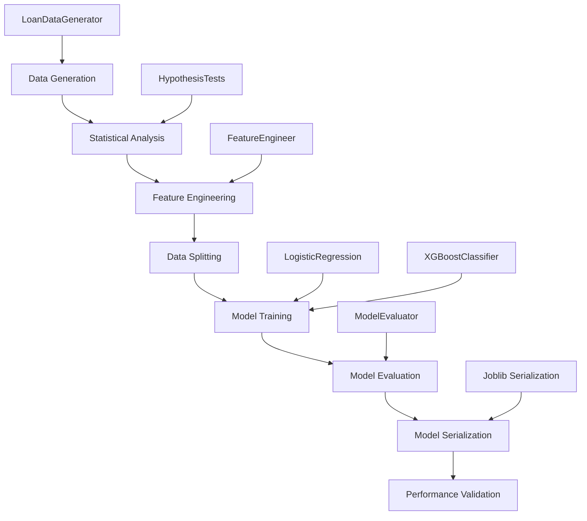
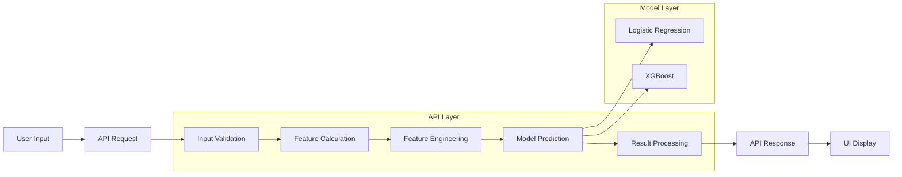
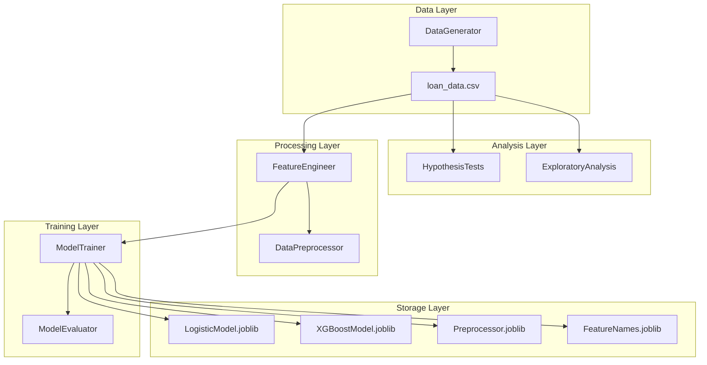
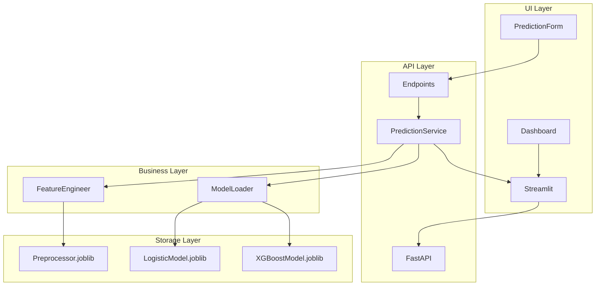
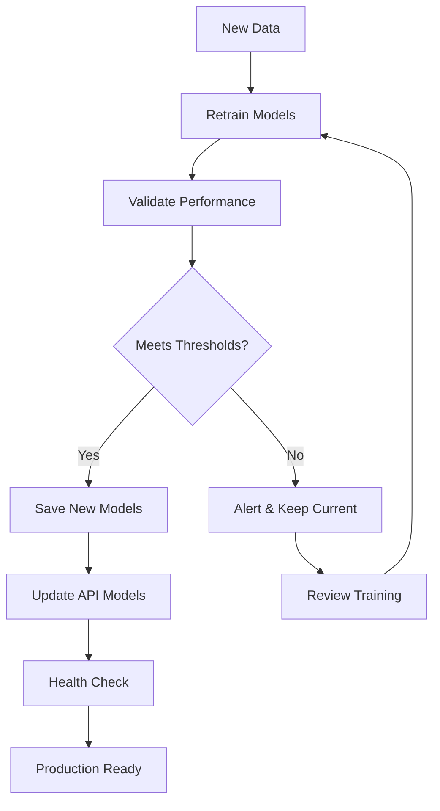

# 🔄 SmartLoan: Technical Workflow & Architecture

## 📋 Table of Contents

1. [System Overview](#system-overview)
2. [Training Architecture](#training-architecture)
3. [Inference Architecture](#inference-architecture)
4. [Data Flow Diagrams](#data-flow-diagrams)
5. [Component Interactions](#component-interactions)
6. [Feature Engineering Pipeline](#feature-engineering-pipeline)
7. [Statistical Analysis Workflow](#statistical-analysis-workflow)
8. [Model Training Pipeline](#model-training-pipeline)
9. [API Architecture](#api-architecture)
10. [UI Components](#ui-components)
11. [Error Handling & Logging](#error-handling--logging)
12. [Performance Optimization](#performance-optimization)

---

## 🏗️ System Overview

SmartLoan is a comprehensive machine learning system for credit risk assessment built with a microservices architecture. The system consists of four main layers:

```
┌─────────────────────────────────────────────────────────┐
│                    PRESENTATION LAYER                   │
│  ┌─────────────────┐    ┌─────────────────────────────┐ │
│  │   Streamlit UI  │    │      FastAPI Docs UI       │ │
│  │   (Frontend)    │    │     (API Interface)        │ │
│  └─────────────────┘    └─────────────────────────────┘ │
└─────────────────────────────────────────────────────────┘
                               │
┌─────────────────────────────────────────────────────────┐
│                    API GATEWAY LAYER                    │
│  ┌─────────────────────────────────────────────────────┐ │
│  │              FastAPI Microservice                  │ │
│  │    ┌──────────┐ ┌──────────┐ ┌──────────────────┐  │ │
│  │    │Prediction│ │Model Info│ │Health & Debug    │  │ │
│  │    │Endpoints │ │Endpoints │ │Endpoints         │  │ │
│  │    └──────────┘ └──────────┘ └──────────────────┘  │ │
│  └─────────────────────────────────────────────────────┘ │
└─────────────────────────────────────────────────────────┘
                               │
┌─────────────────────────────────────────────────────────┐
│                   BUSINESS LOGIC LAYER                  │
│  ┌─────────────┐ ┌─────────────┐ ┌─────────────────────┐ │
│  │   Feature   │ │   Model     │ │    Statistical     │ │
│  │ Engineering │ │  Training   │ │     Analysis       │ │
│  └─────────────┘ └─────────────┘ └─────────────────────┘ │
└─────────────────────────────────────────────────────────┘
                               │
┌─────────────────────────────────────────────────────────┐
│                     DATA LAYER                          │
│  ┌─────────────┐ ┌─────────────┐ ┌─────────────────────┐ │
│  │    Raw      │ │  Processed  │ │     Model           │ │
│  │    Data     │ │    Data     │ │   Artifacts         │ │
│  └─────────────┘ └─────────────┘ └─────────────────────┘ │
└─────────────────────────────────────────────────────────┘
```

### Core Components

| Component | Purpose | Technology | Location |
|-----------|---------|------------|----------|
| **Data Generator** | Synthetic loan data creation | Python/Pandas | `data/data_generator.py` |
| **Feature Engineer** | Feature creation & preprocessing | Scikit-learn | `preprocessing/feature_engineering.py` |
| **Statistical Analyzer** | Hypothesis testing & EDA | SciPy/Statsmodels | `analysis/hypothesis_testing.py` |
| **Model Trainer** | ML model training & evaluation | XGBoost/Sklearn | `models/model_trainer.py` |
| **API Service** | RESTful API for predictions | FastAPI | `api/main.py` |
| **Web Interface** | Interactive dashboard | Streamlit | `ui/streamlit_app.py` |

---

## 🎓 Training Architecture

### Training Workflow Overview



### 1. Data Generation Phase

**File**: `data/data_generator.py`

```python
class LoanDataGenerator:
    def generate_data(self):
        # 1. Generate base demographics
        # 2. Create correlated financial features
        # 3. Engineer derived features
        # 4. Generate realistic default probabilities
        # 5. Create binary target variable
```

**Key Features**:
- **Realistic Correlations**: Income ↔ Credit Score ↔ Employment
- **Risk Factors**: DTI ratio, employment stability, credit utilization
- **Enhanced Signals**: Interaction effects for better model training
- **Configurable**: Sample size, default rate, feature distributions

**Data Schema**:
```
Base Features (11):        Derived Features (8):       Target (1):
├── age                   ├── debt_to_income_ratio    └── default
├── annual_income         ├── loan_to_income_ratio
├── employment_length     ├── payment_to_income_ratio
├── employment_type       ├── monthly_payment
├── home_ownership        ├── credit_score_tier
├── loan_amount          ├── income_category
├── loan_purpose         ├── risk_tier
├── interest_rate        └── affordability_score
├── loan_term
├── credit_score
└── monthly_payment
```

### 2. Statistical Analysis Phase

**File**: `analysis/hypothesis_testing.py`

```python
class HypothesisTests:
    def run_comprehensive_tests(self):
        # 1. Chi-square tests for categorical variables
        # 2. Independent t-tests for numerical variables
        # 3. ANOVA tests for group comparisons
        # 4. Correlation analysis with target variable
```

**Statistical Tests Performed**:

| Test Type | Variables | Purpose | Significance Threshold |
|-----------|-----------|---------|----------------------|
| **Chi-square** | Employment Type, Home Ownership, Loan Purpose | Independence from default | p < 0.05 |
| **T-tests** | Income, Credit Score, DTI Ratio | Mean differences | p < 0.05 |
| **ANOVA** | Income by Employment, Credit by Tier | Group variance | p < 0.05 |
| **Correlation** | All numerical vs Default | Linear relationships | \|r\| > 0.05 |

### 3. Feature Engineering Phase

**File**: `preprocessing/feature_engineering.py`

```python
class FeatureEngineer:
    def create_features(self, df):
        # 1. Validate required base features
        # 2. Calculate derived financial ratios
        # 3. Create categorical binnings
        # 4. Generate interaction features
        # 5. Create risk indicators
        
    def prepare_preprocessor(self, df):
        # 1. Define feature types
        # 2. Create preprocessing pipelines
        # 3. Configure transformers
        # 4. Combine into ColumnTransformer
```

**Feature Engineering Pipeline**:

```
Input Data (14 columns)
         ↓
┌─────────────────────────┐
│   Derived Features      │
│ ┌─────────────────────┐ │
│ │ • DTI Ratio         │ │
│ │ • Payment Ratios    │ │
│ │ │ Affordability     │ │
│ └─────────────────────┘ │
└─────────────────────────┘
         ↓
┌─────────────────────────┐
│  Categorical Features   │
│ ┌─────────────────────┐ │
│ │ • Credit Tiers      │ │
│ │ • Income Categories │ │
│ │ • Age Groups        │ │
│ │ • Risk Tiers        │ │
│ └─────────────────────┘ │
└─────────────────────────┘
         ↓
┌─────────────────────────┐
│   Advanced Features     │
│ ┌─────────────────────┐ │
│ │ • Employment Stable │ │
│ │ • High Risk Loan    │ │
│ │ • Credit Utilization│ │
│ │ • Financial Stress  │ │
│ └─────────────────────┘ │
└─────────────────────────┘
         ↓
┌─────────────────────────┐
│    Preprocessing        │
│ ┌─────────────────────┐ │
│ │Numerical Pipeline   │ │
│ │├─ Imputation        │ │
│ │└─ Standardization   │ │
│ │                     │ │
│ │Categorical Pipeline │ │
│ │├─ Imputation        │ │
│ │└─ One-Hot Encoding  │ │
│ └─────────────────────┘ │
└─────────────────────────┘
         ↓
Final Features (40+ columns)
```

### 4. Model Training Phase

**File**: `models/model_trainer.py`

```python
class ModelTrainer:
    def prepare_data(self):
        # 1. Apply feature engineering
        # 2. Split into train/test sets
        # 3. Validate data quality
        
    def train_logistic_regression(self):
        # 1. Define hyperparameter grid
        # 2. Perform grid search with CV
        # 3. Train best model
        # 4. Evaluate performance
        
    def train_xgboost(self):
        # 1. Configure XGBoost parameters
        # 2. Handle class imbalance
        # 3. Perform hyperparameter tuning
        # 4. Train with early stopping
```

**Training Configuration**:

| Model | Hyperparameters | Cross-Validation | Optimization Metric |
|-------|----------------|------------------|-------------------|
| **Logistic Regression** | C, penalty, solver | 5-fold StratifiedKFold | ROC AUC |
| **XGBoost** | n_estimators, max_depth, learning_rate | 5-fold StratifiedKFold | ROC AUC |

**Data Splitting Strategy**:
```
Total Data (10,000 samples)
         ↓
┌─────────────────────────┐
│   Stratified Split      │
│                         │
│  Training Set: 80%      │
│  (8,000 samples)        │
│                         │
│  Test Set: 20%          │
│  (2,000 samples)        │
│                         │
│  ✓ Preserved default    │
│    rate in both sets    │
└─────────────────────────┘
```

### 5. Model Evaluation Phase

**File**: `models/model_evaluator.py`

```python
class ModelEvaluator:
    def evaluate_model_performance(self):
        # 1. Generate predictions
        # 2. Calculate business metrics
        # 3. Create evaluation reports
        # 4. Generate visualizations
        
    def calculate_business_metrics(self):
        # 1. Standard ML metrics
        # 2. Financial impact metrics
        # 3. Confusion matrix analysis
        # 4. ROC/PR curve analysis
```

**Evaluation Metrics**:

| Category | Metrics | Business Impact |
|----------|---------|-----------------|
| **Classification** | Accuracy, Precision, Recall, F1-Score | Model reliability |
| **Probabilistic** | ROC AUC, PR AUC, Log Loss, Brier Score | Ranking quality |
| **Business** | False Positive Rate, False Negative Rate | Operational costs |
| **Financial** | Expected Loss, Opportunity Cost, Net Benefit | Profitability |

---

## 🔮 Inference Architecture

### Inference Workflow Overview



### 1. API Request Processing

**File**: `api/main.py`

```python
class PredictionService:
    def preprocess_application(self, application):
        # 1. Convert Pydantic model to dict
        # 2. Calculate derived features
        # 3. Create DataFrame
        # 4. Apply feature engineering
        # 5. Return processed features
        
    def predict(self, X_processed, model_name):
        # 1. Load specified model
        # 2. Generate probability prediction
        # 3. Apply decision threshold
        # 4. Calculate risk tier
        # 5. Return prediction results
```

**API Endpoints**:

| Endpoint | Method | Purpose | Input | Output |
|----------|--------|---------|-------|---------|
| `/predict` | POST | Single prediction | LoanApplicationRequest | PredictionResponse |
| `/predict_batch` | POST | Batch predictions | BatchLoanRequest | BatchPredictionResponse |
| `/model_info/{model}` | GET | Model metadata | model_name | ModelInfo |
| `/health` | GET | Service health | None | HealthResponse |
| `/debug/preprocess` | POST | Debug preprocessing | LoanApplicationRequest | Debug info |

### 2. Feature Processing Pipeline

**Inference Feature Flow**:

```
API Input (11 fields)
         ↓
┌─────────────────────────┐
│   Input Validation      │
│ ┌─────────────────────┐ │
│ │ • Pydantic Schema   │ │
│ │ • Range Validation  │ │
│ │ • Type Checking     │ │
│ └─────────────────────┘ │
└─────────────────────────┘
         ↓
┌─────────────────────────┐
│  Derived Calculations   │
│ ┌─────────────────────┐ │
│ │ • Monthly Payment   │ │
│ │ • DTI Ratio         │ │
│ │ • Payment Ratios    │ │
│ └─────────────────────┘ │
└─────────────────────────┘
         ↓
┌─────────────────────────┐
│   Feature Engineering   │
│ ┌─────────────────────┐ │
│ │ • Same as Training  │ │
│ │ • Categorical Bins  │ │
│ │ • Risk Indicators   │ │
│ │ • Preprocessing     │ │
│ └─────────────────────┘ │
└─────────────────────────┘
         ↓
┌─────────────────────────┐
│    Model Prediction     │
│ ┌─────────────────────┐ │
│ │ • Load Model        │ │
│ │ • Predict Proba     │ │
│ │ • Risk Tier         │ │
│ │ • Confidence        │ │
│ └─────────────────────┘ │
└─────────────────────────┘
         ↓
API Response (4 fields)
```

### 3. Model Inference

**Model Loading & Prediction**:

```python
# Model artifacts loaded at startup
models = {
    'logistic_regression': joblib.load('logistic_regression_model.joblib'),
    'xgboost': joblib.load('xgboost_model.joblib')
}

feature_engineer = FeatureEngineer()
feature_engineer.preprocessor = joblib.load('preprocessor.joblib')
feature_engineer.feature_names = joblib.load('feature_names.joblib')

def predict(X_processed, model_name):
    # Select model
    model = models[model_name]
    
    # Get probability prediction
    prob = model.predict_proba(X_processed)[0, 1]
    
    # Risk tier mapping
    if prob < 0.2: risk_tier = "Low Risk"
    elif prob < 0.4: risk_tier = "Medium Risk"
    elif prob < 0.6: risk_tier = "High Risk"
    else: risk_tier = "Very High Risk"
    
    return {
        'default_probability': prob,
        'default_prediction': prob > 0.5,
        'risk_tier': risk_tier,
        'confidence_score': abs(prob - 0.5) * 2
    }
```

---

## 📊 Data Flow Diagrams

### Training Data Flow

```
┌─────────────────┐    ┌─────────────────┐    ┌─────────────────┐
│   Raw Features  │───▶│ Feature Engine  │───▶│ Processed Data  │
│                 │    │                 │    │                 │
│ • Demographics  │    │ • Derive Ratios │    │ • 40+ Features  │
│ • Loan Details  │    │ • Create Bins   │    │ • Standardized  │
│ • Credit Info   │    │ • Risk Scores   │    │ • Encoded       │
└─────────────────┘    └─────────────────┘    └─────────────────┘
                                                        │
                                                        ▼
┌─────────────────┐    ┌─────────────────┐    ┌─────────────────┐
│  Model Output   │◀───│  Model Training │◀───│   Data Split    │
│                 │    │                 │    │                 │
│ • Predictions   │    │ • GridSearchCV  │    │ • Train (80%)   │
│ • Probabilities │    │ • Cross-Validation │ │ • Test (20%)    │
│ • Metrics       │    │ • Model Selection  │ │ • Stratified    │
└─────────────────┘    └─────────────────┘    └─────────────────┘
```

### Inference Data Flow

```
┌─────────────────┐    ┌─────────────────┐    ┌─────────────────┐
│   API Request   │───▶│   Validation    │───▶│  Preprocessing  │
│                 │    │                 │    │                 │
│ • User Input    │    │ • Schema Check  │    │ • Calculate     │
│ • 11 Fields     │    │ • Range Check   │    │   Derived Ratios│
│ • JSON Format   │    │ • Type Check    │    │ • Create Features│
└─────────────────┘    └─────────────────┘    └─────────────────┘
                                                        │
                                                        ▼
┌─────────────────┐    ┌─────────────────┐    ┌─────────────────┐
│  API Response   │◀───│  Model Predict  │◀───│ Feature Vector  │
│                 │    │                 │    │                 │
│ • Probability   │    │ • Load Model    │    │ • 40+ Features  │
│ • Risk Tier     │    │ • Predict Proba │    │ • Same as Train │
│ • Prediction    │    │ • Risk Mapping  │    │ • Preprocessed  │
│ • Confidence    │    │ • Confidence    │    │ • Validated     │
└─────────────────┘    └─────────────────┘    └─────────────────┘
```

---

## 🔧 Component Interactions

### Training Components



### Inference Components



---

## ⚙️ Feature Engineering Pipeline

### Feature Categories

| Category | Count | Examples | Purpose |
|----------|-------|----------|---------|
| **Base Demographics** | 5 | age, annual_income, employment_type | Core borrower info |
| **Loan Details** | 6 | loan_amount, interest_rate, loan_term | Loan characteristics |
| **Derived Ratios** | 4 | debt_to_income_ratio, payment_to_income_ratio | Financial stress indicators |
| **Categorical Bins** | 4 | credit_score_tier, income_category, age_group | Risk stratification |
| **Risk Indicators** | 6 | employment_stability, high_risk_loan, financial_stress | Composite risk factors |
| **Advanced Features** | 3 | payment_burden_score, credit_utilization_proxy | Sophisticated risk metrics |
| **Encoded Features** | 15+ | One-hot encoded categoricals | ML-ready representation |

### Preprocessing Steps

```python
# 1. Numerical Features Pipeline
numerical_transformer = Pipeline([
    ('imputer', SimpleImputer(strategy='median')),
    ('scaler', StandardScaler())
])

# 2. Categorical Features Pipeline  
categorical_transformer = Pipeline([
    ('imputer', SimpleImputer(strategy='constant', fill_value='missing')),
    ('onehot', OneHotEncoder(drop='first', handle_unknown='ignore'))
])

# 3. Combined Preprocessor
preprocessor = ColumnTransformer([
    ('num', numerical_transformer, numerical_features),
    ('cat', categorical_transformer, categorical_features)
])
```

---

## 📈 Statistical Analysis Workflow

### Hypothesis Testing Pipeline

```python
def run_comprehensive_tests(self, df):
    # 1. Chi-square tests for categorical independence
    for var in categorical_vars:
        chi2, p_value, dof, expected = chi2_contingency(
            pd.crosstab(df[var], df['default'])
        )
        
    # 2. T-tests for numerical mean differences
    for var in numerical_vars:
        group_0 = df[df['default'] == 0][var]
        group_1 = df[df['default'] == 1][var]
        t_stat, p_value = ttest_ind(group_0, group_1)
        
    # 3. ANOVA for group variance analysis
    for num_var, cat_var in anova_pairs:
        groups = [df[df[cat_var] == group][num_var] 
                 for group in df[cat_var].unique()]
        f_stat, p_value = f_oneway(*groups)
        
    # 4. Correlation analysis
    for col in numerical_cols:
        corr_coef = df[col].corr(df['default'])
```

### Statistical Validation Results

| Test | Variables Tested | Significant Results | Business Insight |
|------|------------------|-------------------|------------------|
| **Chi-square** | Employment Type | p < 0.001 | Unemployment increases default risk |
| **Chi-square** | Credit Score Tier | p < 0.001 | Lower tiers have higher default rates |
| **T-test** | Annual Income | p < 0.001 | Lower income correlates with default |
| **T-test** | DTI Ratio | p < 0.001 | Higher DTI increases default risk |
| **Correlation** | Credit Score | r = -0.178 | Negative correlation with default |

---

## 🤖 Model Training Pipeline

### Training Configuration

```python
# Logistic Regression Configuration
logistic_params = [
    {
        'C': [0.1, 1, 10, 100],
        'penalty': ['l1', 'l2'],
        'solver': ['liblinear'],
        'max_iter': [1000, 2000]
    },
    {
        'C': [0.1, 1, 10, 100],
        'penalty': ['l1', 'l2', 'elasticnet'],
        'solver': ['saga'],
        'max_iter': [1000, 2000],
        'l1_ratio': [0.5]
    }
]

# XGBoost Configuration
xgboost_params = {
    'n_estimators': [100, 200, 300],
    'max_depth': [3, 4, 5, 6],
    'learning_rate': [0.01, 0.1, 0.2],
    'subsample': [0.8, 0.9, 1.0],
    'colsample_bytree': [0.8, 0.9, 1.0]
}
```

### Cross-Validation Strategy

```python
# 5-Fold Stratified Cross-Validation
cv = StratifiedKFold(n_splits=5, shuffle=True, random_state=42)

# Grid Search with ROC AUC optimization
grid_search = GridSearchCV(
    estimator=model,
    param_grid=param_grid,
    cv=cv,
    scoring='roc_auc',
    n_jobs=-1,
    verbose=1
)
```

### Model Performance Tracking

| Metric | Calculation | Threshold | Business Impact |
|--------|-------------|-----------|-----------------|
| **AUC ROC** | Area under ROC curve | ≥ 0.88 | Overall discrimination |
| **Precision** | TP / (TP + FP) | ≥ 0.85 | Avoid false alarms |
| **Recall** | TP / (TP + FN) | ≥ 0.80 | Catch actual defaults |
| **F1-Score** | Harmonic mean of P&R | ≥ 0.82 | Balanced performance |

---

## 🌐 API Architecture

### FastAPI Service Design

```python
# Service Initialization
app = FastAPI(
    title="SmartLoan API",
    description="ML-based credit risk assessment",
    version="1.0.0"
)

# CORS Configuration
app.add_middleware(
    CORSMiddleware,
    allow_origins=["*"],
    allow_credentials=True,
    allow_methods=["*"],
    allow_headers=["*"],
)

# Global Model Loading
@app.on_event("startup")
async def startup_event():
    prediction_service.load_models()
```

### API Response Schema

```python
class PredictionResponse(BaseModel):
    default_probability: float  # 0.0 to 1.0
    default_prediction: bool    # True/False
    risk_tier: str             # Low/Medium/High/Very High Risk
    confidence_score: float    # 0.0 to 1.0

class BatchPredictionResponse(BaseModel):
    predictions: List[PredictionResponse]
    total_applications: int
    high_risk_count: int
    average_default_probability: float
```

### Error Handling Strategy

```python
# Input Validation Errors
@app.exception_handler(RequestValidationError)
async def validation_exception_handler(request, exc):
    return JSONResponse(
        status_code=422,
        content={"error": "Validation Error", "details": exc.errors()}
    )

# Business Logic Errors
@app.exception_handler(HTTPException)
async def http_exception_handler(request, exc):
    return JSONResponse(
        status_code=exc.status_code,
        content={"error": f"HTTP {exc.status_code}", "message": exc.detail}
    )

# Unexpected Errors
@app.exception_handler(Exception)
async def general_exception_handler(request, exc):
    logger.error(f"Unhandled exception: {str(exc)}")
    return JSONResponse(
        status_code=500,
        content={"error": "Internal Server Error"}
    )
```

---

## 🖥️ UI Components

### Streamlit Architecture

```python
class SmartLoanApp:
    def __init__(self):
        self.api_base_url = f"http://{API_HOST}:{API_PORT}"
    
    def run(self):
        # 1. Check API health
        # 2. Render navigation
        # 3. Route to selected page
        # 4. Handle user interactions
```

### Page Components

| Component | File | Purpose | Features |
|-----------|------|---------|----------|
| **Prediction Form** | `ui/components/prediction_form.py` | Loan application input | Validation, calculations, risk indicators |
| **Analytics Dashboard** | `ui/components/dashboard.py` | Data visualization | KPIs, charts, filters, insights |
| **Main App** | `ui/streamlit_app.py` | Navigation & layout | Multi-page, API integration |

### Interactive Features

```python
# Real-time Calculations
def render_calculated_metrics(self, personal_info, loan_info):
    # Calculate derived metrics
    monthly_payment = calculate_payment(loan_info)
    dti_ratio = loan_info['loan_amount'] / personal_info['annual_income']
    
    # Display with color-coded risk indicators
    st.metric("DTI Ratio", f"{dti_ratio:.1%}", 
             delta="🟢 Good" if dti_ratio <= 0.3 else "🔴 High")

# Interactive Visualizations
def create_risk_gauge(self, probability):
    fig = go.Figure(go.Indicator(
        mode="gauge+number",
        value=probability * 100,
        domain={'x': [0, 1], 'y': [0, 1]},
        title={'text': "Default Risk %"}
    ))
```

---

## 🛡️ Error Handling & Logging

### Logging Configuration

```python
# Centralized Logging Setup
logging.basicConfig(
    level=logging.INFO,
    format='%(asctime)s - %(name)s - %(levelname)s - %(message)s',
    handlers=[
        logging.FileHandler('logs/smartloan.log'),
        logging.StreamHandler()
    ]
)

# Component-specific Loggers
data_logger = logging.getLogger('data')
model_logger = logging.getLogger('models')
api_logger = logging.getLogger('api')
```

### Error Categories

| Error Type | Handling Strategy | User Experience | Logging Level |
|------------|------------------|-----------------|---------------|
| **Validation Errors** | Return 422 with details | Clear field-level messages | WARNING |
| **Model Errors** | Return 500 with generic message | "Prediction unavailable" | ERROR |
| **Data Errors** | Retry with fallbacks | Graceful degradation | WARNING |
| **System Errors** | Return 500, alert admins | "System temporarily unavailable" | CRITICAL |

### Graceful Degradation

```python
def predict_with_fallback(self, application_data):
    try:
        # Try primary XGBoost model
        return self.predict(application_data, 'xgboost')
    except Exception as e:
        logger.warning(f"XGBoost failed: {e}, trying Logistic Regression")
        try:
            # Fallback to Logistic Regression
            return self.predict(application_data, 'logistic_regression')
        except Exception as e2:
            logger.error(f"All models failed: {e2}")
            # Return conservative high-risk prediction
            return {
                'default_probability': 0.7,
                'default_prediction': True,
                'risk_tier': 'High Risk',
                'confidence_score': 0.5
            }
```

---

## ⚡ Performance Optimization

### Model Loading Strategy

```python
# Lazy Loading at Startup
class PredictionService:
    def __init__(self):
        self.models = {}
        self.feature_engineer = None
        
    @lru_cache(maxsize=1)
    def load_models(self):
        # Load once, cache in memory
        self.models['xgboost'] = joblib.load(XGBOOST_MODEL_PATH)
        self.models['logistic_regression'] = joblib.load(LOGISTIC_MODEL_PATH)
        self.feature_engineer = load_feature_engineer()
```

### Preprocessing Optimization

```python
# Vectorized Operations
def calculate_derived_features(self, df):
    # Use pandas vectorized operations
    df['dti_ratio'] = df['loan_amount'] / df['annual_income']
    df['payment_ratio'] = (df['monthly_payment'] * 12) / df['annual_income']
    
    # Avoid loops, use numpy where
    df['high_risk'] = np.where(
        (df['dti_ratio'] > 0.4) | (df['payment_ratio'] > 0.3), 1, 0
    )
```

### API Performance

| Optimization | Implementation | Benefit |
|--------------|----------------|---------|
| **Model Caching** | Load once at startup | Faster predictions |
| **Vectorized Ops** | Pandas/NumPy operations | Efficient computation |
| **Response Compression** | FastAPI gzip middleware | Reduced bandwidth |
| **Connection Pooling** | Async request handling | Higher throughput |
| **Input Validation** | Pydantic models | Early error detection |

### Scalability Considerations

```python
# Async Endpoints for Concurrency
@app.post("/predict_batch")
async def predict_batch(batch_request: BatchLoanRequest):
    # Process multiple applications concurrently
    tasks = [
        predict_single_async(app) 
        for app in batch_request.applications
    ]
    predictions = await asyncio.gather(*tasks)
    return BatchPredictionResponse(predictions=predictions)

# Health Checks for Load Balancing
@app.get("/health")
async def health_check():
    return {
        "status": "healthy" if all_models_loaded() else "degraded",
        "timestamp": datetime.now().isoformat(),
        "version": "1.0.0"
    }
```

---

## 🔄 Deployment Workflow

### Model Update Pipeline



### Production Considerations

| Aspect | Implementation | Monitoring |
|--------|----------------|------------|
| **Model Versioning** | Timestamped model files | Track deployment history |
| **A/B Testing** | Route % traffic to new model | Compare performance metrics |
| **Rollback Strategy** | Keep previous model versions | Automated rollback on errors |
| **Data Drift** | Monitor feature distributions | Alert on significant changes |
| **Performance Decay** | Track AUC over time | Retrain when below threshold |

This comprehensive workflow documentation provides a complete technical understanding of the SmartLoan system architecture, from data generation through production deployment. Each component is designed for modularity, scalability, and maintainability.